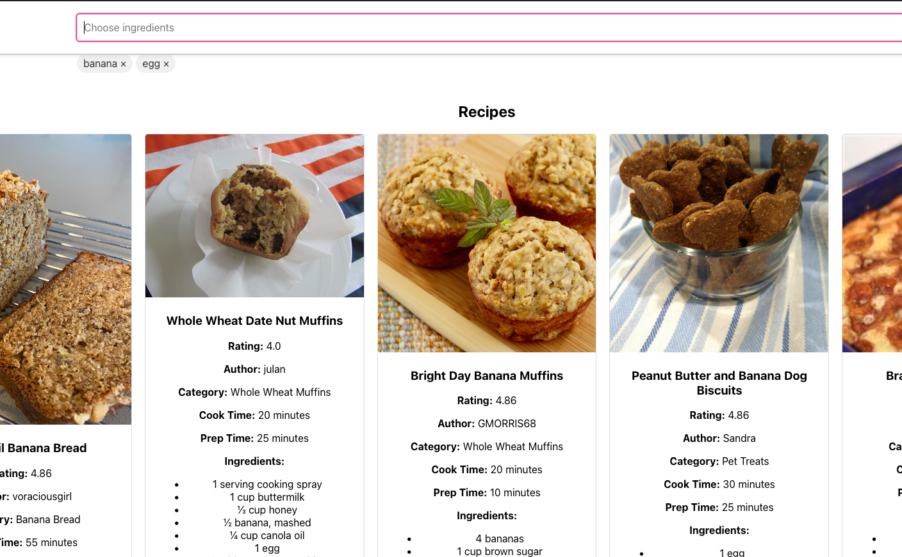
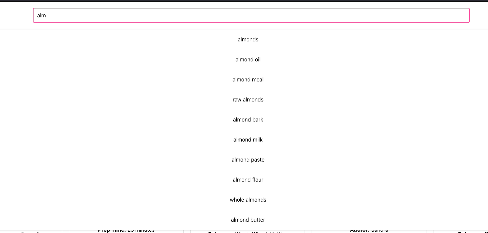

# Recipe Finder

Recipe Finder is a web application that allows users to search for recipes based on ingredients they have. Users can input a list of ingredients, and the application will provide a list of recipes that can be made with those ingredients.

## Table of Contents

- [Project Overview](#project-overview)
- [Features](#features)
- [Technologies Used](#technologies-used)
- [Installation](#installation)
- [Usage](#usage)
- [Links](#links)

## Project Overview

Recipe Finder simplifies the process of finding recipes by allowing users to search for recipes using ingredients they already have at home. It provides a convenient way to discover new recipes and make the most out of available ingredients.

## Main Features

- Search for recipes using a list of ingredients. (If you choose both banana and egg, you'll only get recipes with both banana and egg)

- Autocomplete feature for ingredient input.


## Technologies Used

- Ruby on Rails (API-only)
- React (Separate frontend application)
- PostgreSQL
- Heroku (for deployment)

## Getting Started

To get a copy of the project up and running on your local machine for development and testing purposes, follow the instructions below.

### Installation

1. Clone the repository:

   ```sh
   git clone https://github.com/yourusername/recipe-finder.git
   ```

2. Install dependencies:

   ```sh
   cd recipe-finder
   bundle install
   cd client
   npm install
   ```

## Usage

After following the installation steps, you can start the development server:

   ```sh
   rails s
   ```

And in client folder:
  ```sh
   npm start
   ```

## Links

Frontend application (it's fully integrated with backend):

https://sheltered-thicket-53939-9a47a8fe89e9.herokuapp.com/

Backend API:

https://blooming-gorge-03957-7688af9dfbce.herokuapp.com/